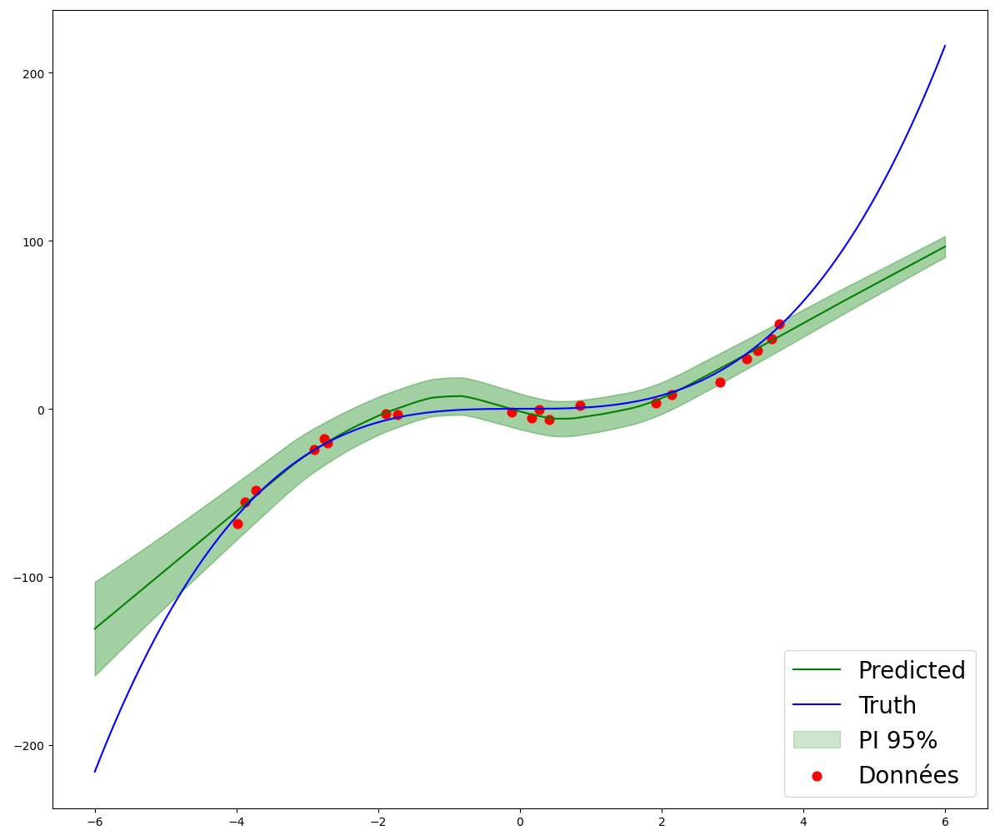

#################
Basic examples
#################

To illustrate the use of the package, we use a simple dataset taken from the article [1]_ and used in the presentation of the 
Deep Ensemble model [2]_.

1. Toy dataset
---------------

This dataset consists of 20 training examples randomly selected according to the relationship

.. math::
    y = x^3 + \epsilon, ~~ \epsilon \sim \mathcal{N}(0, 9)

with :math:`x` in the range :math:`[-4, 4]`. We use the following code to generate the dataset.

.. code-block:: python
    
    import numpy as np
    import matplotlib.pyplot as plt

    # Generate the dataset
    np.random.seed(12)
    N = 20
    X = np.random.rand(N,1)*8 -4 ; X_graph = np.linspace(-6, 6, 500).reshape(-1,1)
    y = X**3 + np.random.randn(N,1)*3 ; y_graph = X_graph**3

    # Plot the dataset
    fig = plt.figure(figsize=(12,12))
    plt.plot(X_graph, y_graph, 'b', label='y = x^3')
    plt.scatter(X, y, s=60, c="r",label='Données')
    plt.legend(loc="lower right")
    plt.show()

.. image:: toy_dataset.png
    :align: center
    :alt: toy dataset
    :width: 600px

2. DeepEnsemble 1
----------------------

At present, there is 2 way to use the Deep Ensemble model. It's possible to predict the mean
and the variance or just predict the mean for each model. Here we present the first example
predicting only the mean.

Firstly, it's necessary to construct the structure of one model. In this first case, it is easy as
the model is just a regular deterministic model. We use the following code to create the model.

.. code-block:: python
    
    from tensorflow.keras.models import Model
    from tensorflow.keras.layers import Dense, Input
    from tensorflow.keras.initializers import RandomNormal

    # Specify input and output shape
    input_shape = (1,) ; output_shape = 1

    # Specify the initialisation of the weights
    ki = RandomNormal(mean=0.0, stddev=0.4, seed=12)

    # Create one model
    inputs = Input(shape=input_shape, name="input")
    x = Dense(100, activation="relu", name="hidden_layer", kernel_initializer=ki)(inputs)
    outputs = Dense(output_shape, name="output", kernel_initializer=ki)(x)
    model = Model(inputs=inputs, outputs=outputs)

.. tip::
    The kernel initializer is used to have a larger variance of the weights and thus 
    a better diversity in the models.

Now, thanks to the package :mod:`Purestochastic`, it's possible to convert directly the model
into a Deep Ensemble model : 

    >>> from purestochastic.model.deep_ensemble import toDeepEnsemble
    >>>
    >>> nb_models = 5
    >>> deep_ensemble = toDeepEnsemble(model, nb_models=nb_models)
    Your network is compatible with a fully parallelizable implementation.
    >>> deep_ensemble.summary()
    Model: "deep_ensemble_model"
    _________________________________________________________________
    Layer (type)                        Output Shape        Param #   
    =================================================================
    input (InputLayer)                  [(None, 1)]         0                                                            
    ensemble_hidden_layer (Dense2Dto3D)  (None, 5, 100)     1000                                                                                           
    ensemble_output (Dense3Dto3D)        (None, 5, 1)       505                                                                                                                        
    =================================================================
    Total params: 1,505
    Trainable params: 1,505
    Non-trainable params: 0
    _________________________________________________________________

Then, you have to compile the model and launch the training as usual with keras API. You have
the possibility to put the model into an :class:`GaussianRegression` object that will allow
you to make all the pre-processing and post-processing of the data.

.. code-block:: python

    from tensorflow.keras.opitimizers import Adam
    from purestochastic.model.base_uncertainty_models import GaussianRegression

    # Compile the model
    deep_ensemble.compile(loss="mse", optimizer=Adam(learning_rate=0.02))

    # Create a GaussianRegression task
    reg = GaussianRegression(deep_ensemble)

    # Train the model for 40 epochs
    reg.fit(X, y, epochs=40)

For the ``predict`` method, it's the same as usual except that the output is tuple of 2 values with the mean and the variance.

    >>> y_mean, y_var = reg.predict(X_graph)
    >>> y_mean.shape
    (500, 1)
    >>> y_var.shape
    (500, 1)
    >>> fig = plt.figure(figsize=(12,12))
    >>> plt.plot(X_graph, y_mean, 'g', label='Predicted')
    >>> plt.plot(X_graph, y_graph, 'b', label='Truth')
    >>> plt.fill_between(X_graph.reshape(-1), y_mean.reshape(-1) - 1.96*np.sqrt(y_var.reshape(-1)), y_mean.reshape(-1) + 1.96*np.sqrt(y_var.reshape(-1)), alpha=0.2, color='g')
    >>> plt.scatter(X, y, s=60, c="r",label='Données')
    >>> plt.legend(loc="lower right")
    >>> plt.tight_layout()
    >>> plt.show()

    
    Predictions of the regular Deep Ensemble model on the Toy dataset.

All the code to reproduce the example is available in :download:`deep_ensemble1.py <../../examples/deep_ensemble1.py>`.

3. DeepEnsemble 2
----------------------

In the previous section, we have presented the first way of using the Deep Ensemble model using a regular network.
However, the previous model assumes that the data is sampled from a homoscedastic Gaussian distribution and this is a 
strong assumption. To overcome this issue, the second way is to use a model that predicts the mean and the variance of
a predicted gaussian random value for each data point. To build this model, we use the following code.

.. code-block:: python
    
    from tensorflow.keras.models import Model
    from tensorflow.keras.layers import Dense, Input
    from tensorflow.keras.initializers import RandomNormal
    from purestochastic.model.layers import Dense2Dto3D
    from purestochastic.model.activations import MeanVarianceActivation

    # Specify input and output shape
    input_shape = (1,) ; output_shape = 1

    # Specify the initialisation of the weights
    ki = RandomNormal(mean=0.0, stddev=0.3, seed=8888)

    # Create one model
    inputs = Input(shape=input_shape, name="input")
    x = Dense(100, activation="relu", name="hidden_layer", kernel_initializer=ki)(inputs)
    outputs = Dense2Dto3D(output_shape, 2, activation=MeanVarianceActivation, name="output", kernel_initializer=ki)(x)
    model = Model(inputs=inputs, outputs=outputs)

.. note::
    We use the :class:`Dense2Dto3D` layer to predict the mean and the variance of the gaussian random value.
    It's useful to structure the output. 

.. tip::
    To enforce the positivity of the variance, we use the activation function :func:`MeanVarianceActivation`
    on the output layer. The model is equivalent to a MVEM model.
    

Then, it is nearly the same as before except that we can't use the MSE loss function. When the model outputs the mean and the variance,
a good choice is to optimize the Gaussian Negative Log Likelihood function defined by the package as :func:`gaussian_negative_log_likelihood`.

.. code-block:: python

    from purestochastic.common.losses import gaussian_negative_log_likelihood
    from purestochastic.model.activations import MeanVarianceActivation

    nb_models = 5
    deep_ensemble = toDeepEnsemble(model, nb_models=nb_models)

    # Compile the model
    deep_ensemble.compile(loss=gaussian_negative_log_likelihood, optimizer=Adam(learning_rate=0.02))

    # Create a GaussianRegression task
    reg = GaussianRegression(deep_ensemble)

    # Train the model for 40 epochs
    reg.fit(X, y, epochs=40)

Finally, when we use the :func:`predict` function, we get now a tuple of 3 values. Indeed, with the 
:func:`MeanVarianceActivation` activation function and the :class:`DeepEnsemble` model, the variance
can be separated into an epistemic and an aleatoric component. The prediction interval represented 
in the figure below are the one computed only with the aleatoric component and the one computed with 
the total variance.

    Predictions of the MVEM Deep Ensemble model on the Toy dataset.

All the code to reproduce the example is available in :download:`deep_ensemble2.py <../../examples/deep_ensemble2.py>`.

4. SWAG
----------------------

For other models, it's similar as DeepEnsemble. The difference for each model is the ``kwargs`` parameters that we can specify for the methods 
``fit`` and ``predict``. For instance, the parameter ``start_averaging`` of the method ``fit`` in the :class:`SWAGModel` is important and need 
to be specify to have good results : 

.. code-block:: python

    # Train the model for 55 epochs
    reg.fit(X, y, epochs=55, learning_rate=0.008, start_averaging=40)

    Predictions of the SWAG model on the Toy dataset.

All the code to reproduce the example is available in :download:`swag.py <../../examples/swag.py>`.

5. MultiSWAG
----------------------

The class :class:`StochasticModel` allows to use metrics during the training of the model. For example, if we want to see the
evolution of the PICP (Prediction Interval Coverage Probability) during the training, it is sufficient to add it during the 
call to the method ``compile``.

    >>> from purestochastic.common.metrics import PredictionIntervalCoverageProbability
    >>> multi_swag.compile(loss=gaussian_negative_log_likelihood, optimizer=Adam(learning_rate=0.02), stochastic_metrics=[PredictionIntervalCoverageProbability(0.8)])
    >>> 
    >>> reg = GaussianRegression(multi_swag)
    >>> reg.fit(X, y, epochs=55, learning_rate=0.008, start_averaging=40)
    Epoch 1/40
    1/1 [==============================] - 3s 3s/step - loss: 2.6212 - picp: 0.9000
    Epoch 2/40
    1/1 [==============================] - 0s 6ms/step - loss: 1.3922 - picp: 1.0000
    Epoch 3/40
    1/1 [==============================] - 0s 10ms/step - loss: 1.0888 - picp: 1.0000
    Epoch 4/40
    1/1 [==============================] - 0s 9ms/step - loss: 1.0117 - picp: 1.0000
    Epoch 5/40
    1/1 [==============================] - 0s 7ms/step - loss: 1.0116 - picp: 1.0000
    Epoch 6/40
    1/1 [==============================] - 0s 9ms/step - loss: 1.0726 - picp: 1.0000
    Epoch 7/40
    1/1 [==============================] - 0s 8ms/step - loss: 1.0793 - picp: 1.0000
    Epoch 8/40
    1/1 [==============================] - 0s 5ms/step - loss: 1.0857 - picp: 1.0000
    Epoch 9/40
    1/1 [==============================] - 0s 6ms/step - loss: 1.0608 - picp: 1.0000
    Epoch 10/40
    1/1 [==============================] - 0s 9ms/step - loss: 1.0468 - picp: 1.0000
    Epoch 11/40
    1/1 [==============================] - 0s 13ms/step - loss: 1.0081 - picp: 1.0000
    Epoch 12/40
    1/1 [==============================] - 0s 9ms/step - loss: 0.9568 - picp: 0.9500
    Epoch 13/40
    1/1 [==============================] - 0s 8ms/step - loss: 0.9007 - picp: 0.9500
    Epoch 14/40
    1/1 [==============================] - 0s 7ms/step - loss: 0.8316 - picp: 0.9500
    Epoch 15/40
    1/1 [==============================] - 0s 5ms/step - loss: 0.7517 - picp: 0.9500
    ...

With this functionnality, it is also possible to save the training history of the model with stochastic metrics. It is possible to
know the values of the metrics at the end of the training with the method ``evaluate``.

    >>> reg.evaluate(X_graph, y_graph)
    {'loss': -0.6353859901428223, 'picp': 0.6538169980049133}

.. figure:: multi_swag.png
    :align: center
    :alt: MultiSWAG
    :width: 600px
    
    Predictions of the regular MultiSWAG model on the Toy dataset.

All the code to reproduce the example is available in :download:`multi_swag.py <../../examples/multi_swag.py>`. 

.. raw:: html

   <h2>References</h2> 

.. [1] José Miguel Hernández-Lobato et Ryan P. Adams. « Probabilistic backpropagation for sca-
    lable learning of Bayesian neural networks ». In : 32nd International Conference on Machine
    Learning, ICML 2015 3 (2015), p. 1861-1869. arXiv : 1502.05336.

.. [2] Balaji Lakshminarayanan, Alexander Pritzel et Charles Blundell. « Simple and scalable
    predictive uncertainty estimation using deep ensembles ». In : Advances in Neural Information
    Processing Systems 2017-Decem.Nips (2017), p. 6403-6414. issn : 10495258. arXiv : 1612.01474.