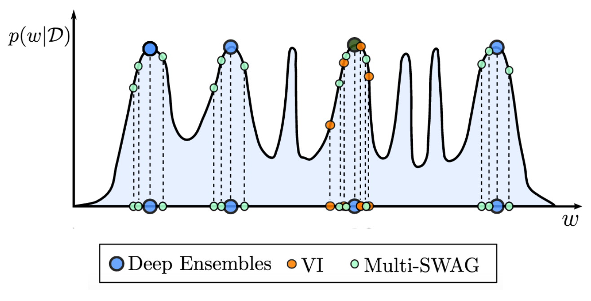

######################
Custom Models
######################

This module contains all the custom stochastic models. It helps the user to choose a pre-implemented model 
and to use directly on its own use case. The first class :class:`StochasticModel` is an abstract class on which
all other class are based on.

Each custom model has a custom class that is a subclass of :class:`StochasticModel` and a high-level function that allows
to convert to usual object of type `tf.keras.Model <https://www.tensorflow.org/api_docs/python/tf/keras/Model>`_ 
or `tf.keras.SequentialModel <https://www.tensorflow.org/api_docs/python/tf/keras/Sequential>`_ to the corresponding 
model.

The list of available models is :

.. contents:: :local:
    :depth: 2

Stochastic Model
~~~~~~~~~~~~~~~~~~~~~~

:class:`StochasticModel` is a subclass of `tf.keras.Model <https://www.tensorflow.org/api_docs/python/tf/keras/Model>`_ that
was defined in order to add stochastic metrics. It's an abstract class that can't be instanciate. All other custom models
are subclasses of :class:`StochasticModel`. 

.. tip::
    If you create a custom stochastic model, you may want it to be a subclass of
    :class:`StochasticModel`.

Ths class is useful to integrate **stochatic metrics** into the training and testing process.
For example, the piece of code below shows how to use the **stochastic metrics** in a custom model : 

>>> model.compile(stochastic_metrics='picp')
>>> model.fit(x_train, y_train, epochs=6)
Epoch 1/6
1/1 [==============================] - 4s 4s/step - loss: 1.5937 - picp: 1.0000
Epoch 2/6
1/1 [==============================] - 0s 9ms/step - loss: 1.1870 - picp: 1.0000
Epoch 3/6
1/1 [==============================] - 0s 10ms/step - loss: 1.1034 - picp: 1.0000
Epoch 4/6
1/1 [==============================] - 0s 6ms/step - loss: 1.0789 - picp: 0.9500
Epoch 5/6
1/1 [==============================] - 0s 5ms/step - loss: 1.0209 - picp: 0.8500
Epoch 6/6
1/1 [==============================] - 0s 6ms/step - loss: 0.9594 - picp: 0.9000

An explanation of the class :class:`StochasticModel` is defined below.

.. autoclass:: purestochastic.model.base_uncertainty_models.StochasticModel
    :members: compute_metrics

MVEM
~~~~~~~~~~~~~~~~~~~~~~

.. TODO::
    Add a class for MVEM which deals with compute_metrics

DeepEnsemble
~~~~~~~~~~~~~~~~~~~~~~

The DeepEnsemble model is an ensemble of Deep Learning model. The idea is to train the same model multiple times with
different random seeds and then average the results in order to have diverse predictions. It's then possible to combine
the predictions. For more details, see the papers `Simple and Scalable Predictive Uncertainty Estimation using Deep Ensembles 
<https://arxiv.org/abs/1612.01474>`_ or `Deep Ensembles: A Loss Landscape Perspective <http://arxiv.org/abs/1912.02757>`_.

.. figure:: DeepEnsemble.png
    :width: 500
    :align: center

    Cartoon illustration of the performance of the DeepEnsemble model from the article **Deep Ensembles: A Loss Landscape Perspective**.

.. tip::
    The DeepEnsemble model seems to work better if the kernel initializer is not set to `'glorot_uniform' <https://www.tensorflow.org/api_docs/python/tf/keras/initializers/glorot_uniform>`_.
    (the default value) but to `'random_normal' <https://www.tensorflow.org/api_docs/python/tf/keras/initializers/random_normal>`_ with a high variance ``stddev``.

Here are some **examples** using the :class:`DeepEnsembleModel` : 

* With **high-level** API (recommended usage) : 

.. code-block:: python
    :linenos:
    :emphasize-lines: 5

    inputs = Input(shape=(input_dim,))
    x = Dense(100, activation="relu")(inputs)
    outputs = Dense2Dto3D(output_dim, 2, activation=MeanVarianceActivation)(x)
    model = Model(inputs=inputs, outputs=outputs)
    DeepEnsemble = toDeepEnsemble(model, nb_models)

* With **low-level** layers : 

.. code-block:: python
    :linenos:
    :emphasize-lines: 4

        inputs = Input(shape=(input_dim,))
        x = Dense2Dto3D(nb_models,100, activation="relu")(inputs)
        outputs = Dense3Dto4D(output_dim, 2, activation=MeanVarianceActivation)(x)
        model = DeepEnsembleModel(inputs=inputs, outputs=outputs)

The :class:`DeepEnsembleModel` and the method ``toDeepEnsemble`` are described above. 

.. autoclass:: purestochastic.model.deep_ensemble.DeepEnsembleModel
    :members:

.. autofunction:: purestochastic.model.deep_ensemble.toDeepEnsemble

SWAG
~~~~~~~~~~~~~~~~~~~~~~

The SWAG model is a bayesian model and especially a bayesian model averaging with variational inference.
The model fits a the posterio distribution of the parameter of the model during the training of the model
exploiting specific properties of the optimization process. For more details, see the papers 
`A Simple Baseline for Bayesian Uncertainty in Deep Learning <https://papers.nips.cc/paper/2019/file/118921efba23fc329e6560b27861f0c2-Paper.pdf>`_.

.. tip :: 
    It's important to fix the learning rate of the second optimization process quite high so that the parameters
    are enough diverse. It's not a problem is the loss is not stable, that is the loss increases and decreases
    itertively.

.. warning ::

    This method uses two optimization process. The first one is the pretaining with the argument given in the ``compile`` method. The second one is the
    training of the model with the argument given in the ``fit`` method.

Here are some **examples** using the :class:`SWAGModel` : 

* With **high-level** API (recommended usage) : 

.. code-block:: python
   :linenos:
   :emphasize-lines: 5

    inputs = Input(shape=(input_dim,))
    x = Dense(100, activation="relu")(inputs)
    outputs = Dense2Dto3D(output_dim, 2, activation=MeanVarianceActivation)(x)
    model = Model(inputs=inputs, outputs=outputs)
    SWAG = toSWAG(model)

* With **low-level** layers : 

.. code-block:: python
   :linenos:
   :emphasize-lines: 4

    inputs = Input(shape=(input_dim,))
    x = Dense(100, activation="relu")(inputs)
    outputs = Dense2Dto3D(output_dim, 2, activation=MeanVarianceActivation)(x)
    model = SWAGModel(inputs=inputs, outputs=outputs)

The :class:`SWAGModel` and the methods ``toSWAG`` and ``SWAGCallback`` are described above. 
The principal logic of the SWAG algorithm is in the :class:`SWAGCallback` class.

.. autoclass:: purestochastic.model.swag.SWAGModel
    :members:

.. autofunction:: purestochastic.model.swag.toSWAG

.. autoclass:: purestochastic.model.swag.SWAGCallback
    :members:

MultiSWAG
~~~~~~~~~~~~~~~~~~~~~~

The MultiSWAG model was developped in order to have the advantages of the SWAG model and the 
DeepEnsemble model. Therefore, it's an ensemble of bayesian deep learning models. For more
details, see `Bayesian deep learning and a probabilistic perspective of generalization 
<https://arxiv.org/pdf/2002.08791.pdf>`_.

    Cartoon illustration of comparison between the SWAG, DeepEnsemble model and the MultiSWAG model from the paper **Bayesian deep learning and a probabilistic perspective of generalization**.

Here are some **examples** using the :class:`MultiSWAGModel` : 

* With **high-level** API (recommended usage) : 

.. code-block:: python
   :linenos:
   :emphasize-lines: 5

    inputs = Input(shape=(input_dim,))
    x = Dense(100, activation="relu")(inputs)
    outputs = Dense2Dto3D(output_dim, 2, activation=MeanVarianceActivation)(x)
    model = Model(inputs=inputs, outputs=outputs)
    DeepEnsemble = toMultiSWAG(model, nb_models)

* With **low-level** layers : 

.. code-block:: python
   :linenos:
   :emphasize-lines: 4

    inputs = Input(shape=(input_dim,))
    x = Dense2Dto3D(nb_models,100, activation="relu")(inputs)
    outputs = Dense3Dto4D(output_dim, 2, activation=MeanVarianceActivation)(x)
    model = MultiSWAGModel(inputs=inputs, outputs=outputs)

The :class:`MultiSWAGModel` and the method ``toMultiSWAG`` are described above. 

.. autoclass:: purestochastic.model.swag.MultiSWAGModel
    :members:

.. autofunction:: purestochastic.model.swag.toMultiSWAG
